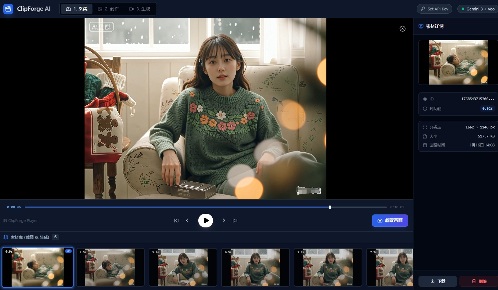
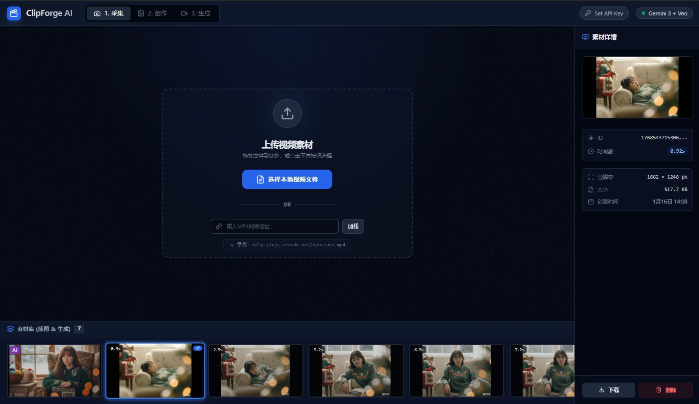
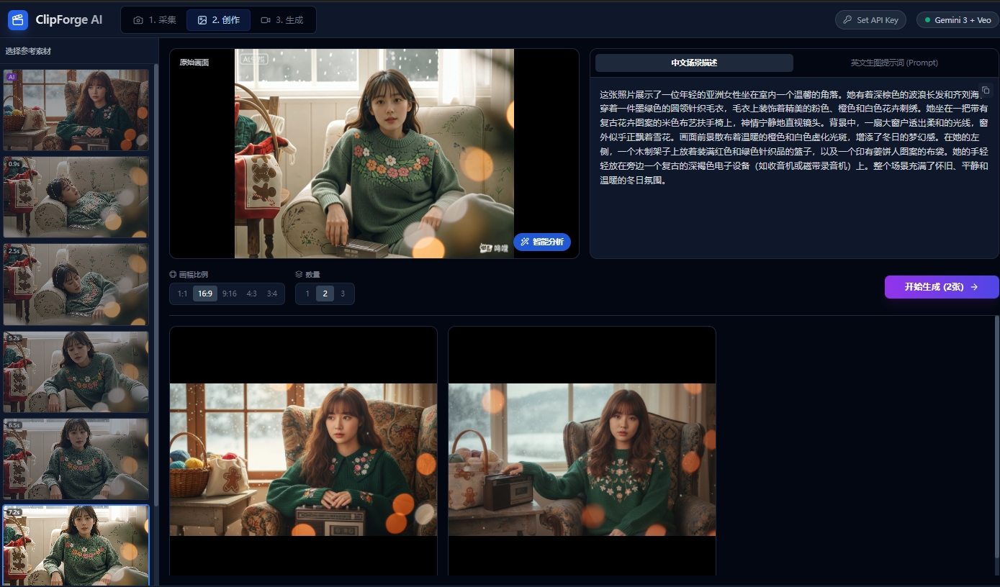
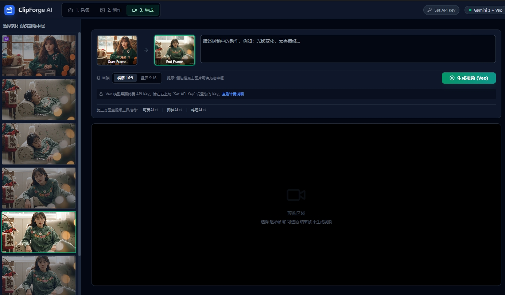

## 功能截图



# ClipForge AI

**ClipForge AI** 是一个基于 AI 的专业视频创作工具。名称源于「剪辑 + 锻造」，寓意帮助创作者打造专业级作品。

## 🎯 项目初衷

在日常视频剪辑工作中，创作者常常面临以下痛点：
- 寻找高质量素材耗时费力
- 重复使用网络素材导致内容同质化
- 版权问题限制作品发布

为了解决这些问题，ClipForge AI 应运而生。通过接入 Google Gemini AI 能力，实现从视频截图到 AI 图像生成，再到视频生成的完整工作流，帮助视频创作者提升效率，产出原创、高质量的作品。

## ✨ 核心功能

| 功能模块 | 描述 |
|---------|------|
| **🎬 视频帧捕获** | 支持本地视频上传和 URL 加载，播放过程中一键截取关键帧，支持逐帧精确定位 |
| **🖼️ AI 图像生成** | 基于截帧智能分析，生成中文场景描述和英文提示词，可自定义画幅比例批量生成图像 |
| **🎥 AI 视频生成** | 支持图生视频技术，可设置起始帧和结束帧，实现平滑自然的视频过渡效果 |
| **📚 素材管理** | 自动保存和管理所有截图与 AI 生成内容，支持下载、删除和状态区分 |

## 功能截图

1 - 采集功能

 

2 - 创作



3 - 生成



视频演示


[](images/xw_20260116141832.mp4)

[📹 ClipForge AI 演示视频下载](images/xw_20260116141832.mp4)

## 🛠️ 技术栈

- **前端框架**: React 19 + TypeScript
- **构建工具**: Vite 6
- **UI 样式**: TailwindCSS
- **AI 集成**: Google GenAI SDK (Gemini 1.5/2.0 + Veo 3.1)
- **图标库**: Lucide React

## 🚀 快速开始

### 环境要求

- Node.js 18+

### 本地运行

```bash
# 1. 安装依赖
npm install

# 2. 配置 API Key
# 在 .env.local 文件中添加您的 Google Gemini API Key
GEMINI_API_KEY=your_api_key_here

# 3. 启动开发服务器
npm run dev

# 应用运行在 http://localhost:3000
```

### 构建部署

```bash
# 构建生产版本
npm run build
```

## 📖 使用流程

```
上传视频 → 播放并截取关键帧 → AI 分析生成提示词 → 生成新图像/视频 → 下载使用
```

## ⚠️ 注意事项

- 使用 Veo 视频生成功能需要开通 Google Cloud Billing 的付费 API Key
- 部分在线视频可能因 CORS 限制无法截取画面
- 建议使用 Chrome/Edge 等现代浏览器以获得最佳体验

## 📄 许可证

MIT License

---

<div align="center">
由 <strong>Google Gemini</strong> 和 <strong>Veo</strong> 强力驱动
</div>
